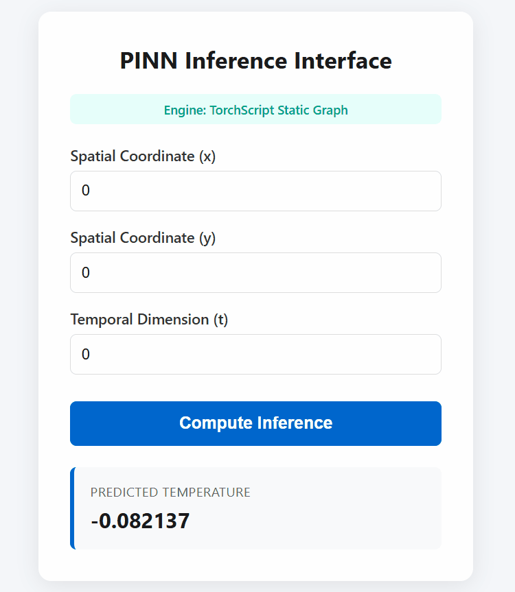

# PINN-Ops: Low-Latency SciML Inference Engine with GitOps Continuous Validation



A production-ready inference service for a Physics-Informed Neural Network (PINN) spatiotemporal surrogate model. The stack combines a TorchScript-compiled PyTorch model, a multi-worker FastAPI/ASGI serving layer, a hardened non-root Docker container, and a GitHub Actions CI pipeline that treats performance as a blocking regression gate.

---

## Project Status

Deployed and benchmarked. The CI pipeline is active on `main`.

---

## Architecture

```
[ Spatial/Temporal Inputs ] -> (x, y, t)
            |
            v
+-----------------+
|  Frontend (UI)  |  <- Served via FastAPI StaticFiles
+-----------------+
            |
            v  (Async JSON)
+------------------------------------------------------------+
| Docker Container  (non-root: appuser / Alpine Linux)       |
|                                                            |
|  [ Port 8000 ]                                             |
|       |                                                    |
|       v                                                    |
|  Master Uvicorn Process (load balancer)                    |
|    |          |          |          |                      |
|    v          v          v          v                      |
|  Worker #1  Worker #2  Worker #3  Worker #4                |
|    |          |          |          |                      |
|    +----------+----+-----+----------+                      |
|                    |                                       |
|                    v                                       |
|         Pydantic Input Validation                          |
|                    |                                       |
|                    v                                       |
|         JIT TorchScript Engine (compiled C++ graph)        |
|                    |                                       |
|                    v                                       |
|            [ Tensor Forward Pass ]                         |
+------------------------------------------------------------+
                    |
                    v
        {"predicted_temperature": float}
```

### 1. Compiled Model Core

Surrogate physics models need microsecond execution to be a viable alternative to classical numerical solvers. During application startup, the PyTorch model is trace-compiled via TorchScript JIT against an empty coordinate tensor. This flattens the MLP into a serialized C++ static computation graph, bypassing the Python GIL entirely and allowing direct matrix evaluation on the host processor without interpreter overhead.

### 2. Async Serving Layer

The runtime is FastAPI on Uvicorn's ASGI server, running four parallel worker processes to saturate available CPU cores. Incoming JSON payloads `(x, y, t)` are validated by a strict Pydantic model before dispatch, catching malformed inputs at the boundary before they touch the inference engine.

### 3. Hardened Container

The service runs on an Alpine Linux base image. The container drops root entirely at runtime — a dedicated `appuser` group and non-privileged user are created at build time, with strict ownership over the serialized model weights and static assets. This defends against privilege escalation exploits at the host kernel boundary.

### 4. GitOps Continuous Validation

Performance is treated as a first-class regression test. Every push to `main` triggers a GitHub Actions runner that:

1. Builds a clean container image from scratch
2. Launches the container and waits for worker JIT warmup to complete
3. Fires `load_server.py` — a multi-threaded parallel stress test that sorts response distributions to track tail latency, not just averages
4. Compares p95/p99 tail latency and throughput against hardcoded quality gates
5. Fails the build and blocks the merge if any gate is breached

The `ci.yml` workflow file is in `.github/workflows/` and can be adapted to adjust worker count, gate thresholds, or target branch triggers.

---

## Performance Benchmarks

Verified under full parallel load across concurrent thread arrays on the production container:

| Metric | Result | Gate | Status |
| :--- | :---: | :---: | :---: |
| Sustained Throughput | 616.52 req/s | > 100 req/s | ✅ Passed |
| p95 Tail Latency | 21.05 ms | < 100 ms | ✅ Passed |
| p99 Tail Latency | 24.49 ms | < 150 ms | ✅ Passed |
| Transaction Success Rate | 100.0% | 100.0% | ✅ Passed |

---

## Project Structure

```
├── .github/
│   └── workflows/
│       └── ci.yml              # CI performance validation pipeline
├── frontend/
│   ├── index.html              # UI layout
│   ├── app.js                  # API fetch and render logic
│   ├── style.css               # Styling
│   └── Demo.gif                # Interface demo
├── server.py                   # FastAPI app — validation, JIT inference, static serving
├── load_server.py              # Parallel stress test and tail latency reporter
├── Dockerfile                  # Non-root Alpine multi-worker image
├── model.pt                    # Serialized TorchScript model weights
└── requirements.txt            # Version-locked Python dependencies
```

---

## Prerequisites

- Docker (tested on 24.x)
- Python 3.12+ (only needed to run `load_server.py` outside Docker)
- `model.pt` — the serialized TorchScript weights must be present in the repo root before building. See [Model Weights](#model-weights) below.

---

## Quickstart

**1. Build the image**
```bash
docker build -t pinn-inference:latest .
```

**2. Run the container**
```bash
docker run -d -p 8000:8000 --name pinn-container pinn-inference:latest
```

**3. Open the UI**
```
http://localhost:8000
```

**4. Run the load test manually**
```bash
python load_server.py
```

This fires the same stress test the CI pipeline runs and prints a full latency distribution report.

---

## Model Weights

`model.pt` is a TorchScript-serialized PINN surrogate model trained to predict spatiotemporal temperature fields `u(x, y, t)` over a unit domain. The model was trained separately and committed to the repo as a binary artifact — it is loaded and JIT-compiled at container startup.

If you want to retrain or swap in a different model, the weights must be TorchScript-compatible (i.e. exported via `torch.jit.trace` or `torch.jit.script`). Update the load path in `server.py` accordingly.

---

## CI Pipeline Details

The workflow in `.github/workflows/ci.yml` runs on every push to `main`. Key steps:

```yaml
# Simplified outline — see ci.yml for full config
- Build Docker image
- Start container (docker run -d ...)
- Sleep N seconds   # absorb JIT warmup across all 4 workers
- Run load_server.py
- Assert: throughput > 100 req/s
- Assert: p95 < 100ms, p99 < 150ms
- Assert: success rate == 100%
```

To tighten or relax the gates, edit the threshold constants at the top of `load_server.py`. To change the trigger branch, update the `on: push: branches:` field in `ci.yml`.
